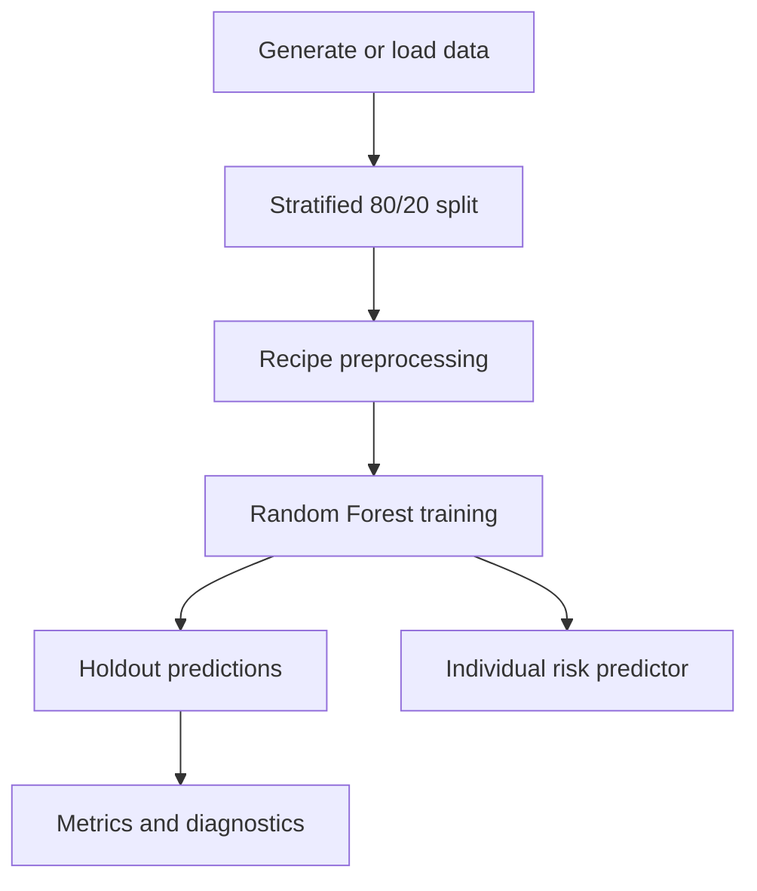

# Credit Risk Analytics & Loan Default Prediction Dashboard

[](https://alif1642.shinyapps.io/credit-risk-shiny/)
[](https://www.r-project.org/)
[](https://shiny.posit.co/)
[](#machine-learning-workflow)
[](#dataset)
[](LICENSE)

An interactive **R/Shiny credit-risk analytics application** for exploring loan-portfolio patterns, evaluating a loan-default classification model, and estimating default probability for an individual applicant profile. It demonstrates an end-to-end workflow spanning data preparation, exploratory analysis, machine learning, model evaluation, interactive visualisation, and business-focused reporting.

> **Important:** This project uses synthetic data only. It is an educational portfolio demonstration and must not be used for real lending, pricing, eligibility, or financial decisions.

## Live Application

**[Launch the Credit Risk Analytics Dashboard →](https://alif1642.shinyapps.io/credit-risk-shiny/)**

The public application is deployed on shinyapps.io. Free hosting instances may take a few moments to start after a period of inactivity.

## Business Problem

Credit teams need clear ways to explore loan-application data, monitor default patterns, evaluate predictive models, and communicate risk insights to decision-makers. This project demonstrates a reproducible workflow that:

- summarises portfolio-level KPIs;
- identifies default-rate patterns across customer and loan segments;
- prepares mixed numeric and categorical data for modelling;
- trains and evaluates a classification model on a held-out test set;
- communicates model-level feature importance; and
- delivers results through an interactive business dashboard.

## Key Features

### Portfolio Overview

- Total customers and loans
- Observed default rate
- Average loan amount and annual income
- Interactive KPI cards
- Business-focused portfolio summary

### Data Explorer

- Searchable and filterable `DT` table
- Employment, outcome, and credit-score filters
- Summary statistics and missing-value profile
- Interactive distribution visualisations

### Credit Risk Analysis

- Default rate by income band
- Default rate by loan-amount band
- Default rate by credit-score band
- Default rate by employment status
- Default rate by loan purpose
- Interactive Plotly tooltips and segment summaries

### Machine Learning & Evaluation

- Stratified 80/20 train/test split
- Median imputation for numeric predictors
- Safe handling of unknown and novel categorical levels
- One-hot encoding and zero-variance removal
- Random Forest classification with 350 trees
- Accuracy, precision, recall, F1-score, and ROC-AUC
- Confusion matrix, ROC curve, and feature importance
- Example predictions from the untouched holdout set

### Individual Risk Predictor

- Validated inputs for applicant and loan characteristics
- Estimated probability of default
- Low, Medium, or High risk category
- Visual probability indicator
- Short, plain-language profile explanation
- Explicit educational-use disclaimer

## Technology Stack

| Area | Technologies |
|---|---|
| Language | R |
| Web application | Shiny, shinythemes |
| Data manipulation | tidyverse, dplyr, readr |
| Visualisation | ggplot2, Plotly, scales |
| Interactive tables | DT |
| Machine learning | tidymodels, randomForest |
| Validation | rsample, yardstick |
| Quality and delivery | Modular R scripts, smoke test, GitHub Actions, shinyapps.io |

## Machine Learning Workflow



The model is fitted only on the training partition. Metrics and diagnostic charts are calculated from the untouched test partition. The positive class is `Yes`, representing a simulated default outcome.

Numeric results are intentionally not hardcoded here because they remain tied to the generated dataset, installed package versions, and fitted model artifact. Open **ML Prediction** and **Model Performance** in the application to inspect the current results.

## Dataset

By default, `R/data_prep.R` generates **3,000 synthetic customer-level loan records** with a deterministic seed. The analytical fields include:

- age and annual income;
- loan amount and loan term;
- credit score and credit-history length;
- employment status and home ownership;
- previous defaults and debt-to-income ratio;
- loan purpose; and
- simulated default outcome.

A small amount of missing data is introduced deliberately to demonstrate data-quality analysis and recipe-based imputation. No real customers, private financial records, or personally identifiable information are included.

A compatible local dataset can be supplied as `data/credit_data.csv`. See [`data/README.md`](data/README.md) for the required schema.

## Project Structure

```text
credit-risk-shiny/
├── .github/workflows/
│   └── smoke-test.yml
├── R/
│   ├── data_prep.R
│   ├── model.R
│   ├── predictions.R
│   └── visualization.R
├── data/
│   └── README.md
├── models/
│   └── README.md
├── screenshots/
│   └── README.md
├── tests/
│   └── smoke_test.R
├── www/
│   └── custom.css
├── app.R
├── DESCRIPTION
├── install.R
├── LICENSE
└── README.md
```

## Run Locally

### Prerequisites

- R 4.3 or newer
- RStudio, VS Code, or another R development environment
- Internet access for the first package installation

### 1. Clone the repository

```bash
git clone https://github.com/Alif1642/credit-risk-shiny.git
cd credit-risk-shiny
```

### 2. Install dependencies

From an R console:

```r
source("install.R")
```

Required packages:

```r
install.packages(c(
  "shiny",
  "shinythemes",
  "tidyverse",
  "tidymodels",
  "randomForest",
  "plotly",
  "DT",
  "readr",
  "scales"
))
```

### 3. Start the application

```r
shiny::runApp()
```

The first launch trains the model and writes a local cache to `models/credit_risk_model.rds`. The cached model is excluded from Git by `.gitignore`.

### 4. Run the smoke test

```r
source("tests/smoke_test.R")
```

The smoke test generates a smaller dataset, trains the complete workflow, validates evaluation outputs, and performs an individual prediction.

## What This Project Demonstrates

- R programming and modular application design
- Shiny dashboard development
- Data cleaning and missing-value analysis
- Exploratory and segment-level analysis
- Classification modelling with `tidymodels`
- Feature preprocessing and train/test validation
- Accuracy, precision, recall, F1-score, and ROC-AUC evaluation
- Confusion-matrix and ROC-curve interpretation
- Random Forest feature importance
- Interactive Plotly visualisation and searchable tables
- Business-focused KPI reporting
- Responsible communication of model limitations
- Automated smoke testing and public Shiny deployment

## Responsible Use & Limitations

- The data is synthetic and does not represent any bank, lender, or customer population.
- The model has not been validated for real financial use.
- Risk categories are demonstration thresholds, not lending policy.
- The explanation panel uses transparent profile rules; it is not a causal explanation or local SHAP analysis.
- Feature importance is model-level Random Forest importance and must not be interpreted as causality.
- A real credit-risk system would require representative data, bias and fairness testing, probability calibration, stability monitoring, security controls, governance, regulatory review, and independent validation.
- Human review and lawful, documented policy would remain essential.

## Future Improvements

- Add cross-validation and hyperparameter tuning.
- Benchmark Random Forest against logistic regression and gradient boosting.
- Add probability-calibration diagnostics and threshold-cost analysis.
- Add subgroup fairness and model-stability monitoring.
- Add authenticated role-based access for an internal deployment.
- Store approved model versions and monitoring results in a database.
- Add validated local explanation methods.

## Author

**Md. Alif Hossen**  
AI/ML Engineer · Data Science · Machine Learning

- [GitHub](https://github.com/Alif1642)
- [LinkedIn](https://www.linkedin.com/in/md-alif-hossen1642)
- [Portfolio](https://alif1642.github.io/portfolio/)
- [Live Demo](https://alif1642.shinyapps.io/credit-risk-shiny/)

## Licenses

This project is available under the [MIT License](LICENSE).
