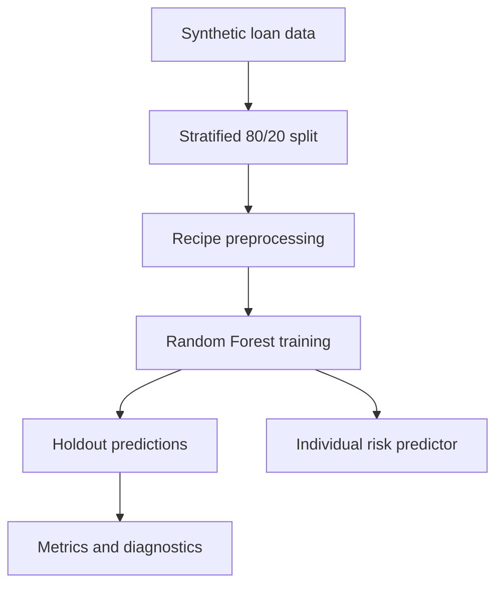

# Credit Risk Analytics & Loan Default Prediction Dashboard

[](https://www.r-project.org/)
[](https://shiny.posit.co/)
[](#machine-learning-workflow)
[](#dataset)
[](LICENSE)

An interactive R/Shiny application for exploring credit-risk patterns, evaluating a loan-default classification model, and estimating default probability for an individual applicant profile. The project is designed as a transparent portfolio demonstration of data science, statistical analysis, machine learning, interactive visualisation, and business-oriented analytics.

> **Important:** The repository uses synthetic data only. It is an educational portfolio project and must not be used for real lending, pricing, eligibility, or financial decisions.

## Business Problem

Credit teams need reliable ways to explore loan-application data, monitor default patterns, evaluate predictive models, and communicate risk insights to decision-makers. This project demonstrates an end-to-end analytical workflow that:

- summarizes portfolio-level KPIs;
- identifies default-rate patterns across customer and loan segments;
- prepares mixed numeric and categorical data for modelling;
- trains and evaluates a classification model on a held-out test set;
- explains model-level feature importance; and
- delivers results through a recruiter-friendly interactive dashboard.

## Key Objectives

1. Build a reproducible credit-risk analysis workflow in R.
2. Create an interactive Shiny dashboard for portfolio exploration and KPI monitoring.
3. Train a Random Forest classifier using `tidymodels`.
4. Evaluate classification performance with multiple complementary metrics.
5. Provide a safe individual prediction interface with clear limitations.
6. Keep the repository modular, documented, and ready to run after cloning.

## Features

### Overview

- Total customers and loans
- Observed default rate
- Average loan amount
- Average annual income
- Interactive KPI cards
- Business-focused portfolio summary

### Data Explorer

- Searchable, filterable `DT` table
- Employment, outcome, and credit-score filters
- Summary statistics
- Missing-value profile
- Interactive distribution charts

### Credit Risk Analysis

- Default rate by income band
- Default rate by loan-amount band
- Default rate by credit-score band
- Default rate by employment status
- Default rate by loan purpose
- Interactive Plotly tooltips and segment summaries

### Machine-Learning Workflow

- Stratified 80/20 train/test split
- Median imputation for numeric predictors
- Safe handling of unknown and novel categorical levels
- One-hot encoding
- Zero-variance predictor removal
- Random Forest classification with 350 trees
- Untouched holdout-set predictions

### Individual Risk Predictor

- Validated inputs for age, income, loan amount, term, credit score, employment, prior defaults, debt-to-income ratio, loan purpose, home ownership, and credit-history length
- Estimated probability of default
- Low, Medium, or High risk category
- Visual probability indicator
- Short, plain-language profile explanation
- Explicit educational-use disclaimer

### Model Performance

- Accuracy
- Precision
- Recall
- F1-score
- ROC-AUC
- Confusion matrix
- ROC curve
- Random Forest feature importance

## Technology Stack

| Area | Technologies |
|---|---|
| Language | R |
| Web application | Shiny, shinythemes |
| Data manipulation | tidyverse, dplyr, readr |
| Visualisation | ggplot2, Plotly, scales |
| Tables | DT |
| Machine learning | tidymodels, randomForest |
| Reproducibility | deterministic seed, modular scripts, GitHub Actions smoke test |

## Machine-Learning Workflow



The model is trained only on the training partition. Reported metrics and diagnostic charts use the untouched test partition. The positive class is `Yes`, meaning default.

### Evaluation approach

The application calculates metrics each time a new model bundle is trained. Numeric results are intentionally not hardcoded in this README because they should remain tied to the generated dataset, package versions, and fitted model artifact. Open **ML Prediction** and **Model Performance** in the application to inspect the current results.

Metric interpretation:

- **Accuracy:** overall share of correct classifications.
- **Precision:** share of predicted defaults that are actual defaults.
- **Recall:** share of actual defaults identified by the model.
- **F1-score:** harmonic balance between precision and recall.
- **ROC-AUC:** ranking performance across classification thresholds.

## Dataset

The default dataset is generated locally by `R/data_prep.R` using a deterministic seed. It contains 3,000 synthetic customer-level loan records with realistic analytical fields:

- age;
- annual income;
- loan amount and term;
- credit score;
- employment status;
- previous defaults;
- debt-to-income ratio;
- loan purpose;
- home ownership;
- credit-history length; and
- simulated default outcome.

A small amount of missing data is introduced deliberately so the dashboard can demonstrate data-quality analysis and recipe-based imputation.

No real customers, private financial records, or personally identifiable information are included.

To use a compatible local CSV, place it at `data/credit_data.csv`. See [`data/README.md`](data/README.md) for the exact schema.

## Project Architecture

```text
credit-risk-shiny/
├── .github/
│   └── workflows/
│       └── smoke-test.yml
├── R/
│   ├── data_prep.R
│   ├── model.R
│   ├── predictions.R
│   └── visualization.R
├── data/
│   └── README.md
├── models/
│   └── README.md
├── screenshots/
│   └── README.md
├── tests/
│   └── smoke_test.R
├── www/
│   └── custom.css
├── .gitignore
├── app.R
├── DESCRIPTION
├── install.R
├── LICENSE
└── README.md
```

## Run Locally

### Prerequisites

- R 4.3 or newer recommended
- RStudio or another R development environment
- An internet connection for the first package installation

### 1. Clone the repository

```bash
git clone https://github.com/<YOUR_GITHUB_USERNAME>/credit-risk-shiny.git
cd credit-risk-shiny
```

### 2. Install packages

From the R console:

```r
source("install.R")
```

Or install them directly:

```r
install.packages(c(
  "shiny",
  "shinythemes",
  "tidyverse",
  "tidymodels",
  "randomForest",
  "plotly",
  "DT",
  "readr",
  "scales"
))
```

### 3. Start the application

```r
shiny::runApp()
```

The first start trains the model and writes a local cache to `models/credit_risk_model.rds`. The cache is excluded from Git.

### 4. Run the smoke test

```r
source("tests/smoke_test.R")
```

The smoke test generates a smaller dataset, trains the complete workflow, checks the evaluation outputs, and makes an individual prediction.

## Required R Packages

```text
shiny
shinythemes
tidyverse
tidymodels
randomForest
plotly
DT
readr
scales
```

## Screenshots

Add exported screenshots after running the application locally:

```text
screenshots/overview.png
screenshots/risk-analysis.png
screenshots/individual-predictor.png
screenshots/model-performance.png
```

Suggested Markdown after adding images:

```markdown


```

The repository intentionally does not include fabricated screenshots or claim a live deployment.

## What This Project Demonstrates

- R programming
- Shiny dashboard development
- Data cleaning and missing-value analysis
- Exploratory Data Analysis
- Statistical and segment analysis
- Machine-learning classification
- Feature engineering and preprocessing recipes
- Train/test validation
- Accuracy, precision, recall, F1-score, and ROC-AUC evaluation
- Confusion-matrix and ROC-curve interpretation
- Random Forest feature importance
- Interactive Plotly visualisation
- Searchable analytical tables
- Business-oriented KPI reporting
- Safe communication of model limitations
- Modular repository design and reproducible workflows

## Responsible Use and Limitations

- The data is synthetic and does not represent any bank, lender, or customer population.
- The model has not been validated for real financial use.
- Risk categories are portfolio-demo thresholds, not lending policy.
- The explanation panel highlights profile factors using transparent rules; it is not a causal explanation or local SHAP analysis.
- Feature importance is model-level Random Forest importance and must not be interpreted as causality.
- A real credit-risk system would require representative data, bias and fairness testing, calibration analysis, stability monitoring, security controls, governance, regulatory review, and independent validation.
- Human review and lawful, documented policy would remain essential.

## Future Improvements

- Add cross-validation and hyperparameter tuning.
- Compare Random Forest with logistic regression and gradient boosting.
- Add probability-calibration diagnostics and threshold-cost analysis.
- Add subgroup fairness and stability monitoring.
- Add authenticated role-based access for a deployed internal dashboard.
- Store approved model versions and monitoring results in a database.
- Add local explanation methods after validating an appropriate package and methodology.
- Deploy to shinyapps.io or Posit Connect after environment and resource testing.

## GitHub Setup and Push

Create an empty GitHub repository named `credit-risk-shiny`, then run:

```bash
git init
git add .
git commit -m "Build credit risk analytics Shiny dashboard"
git branch -M main
git remote add origin https://github.com/<YOUR_GITHUB_USERNAME>/credit-risk-shiny.git
git push -u origin main
```

Recommended GitHub description:

> Interactive R/Shiny dashboard for credit risk analytics and loan default prediction using machine learning.

## Author

**Md. Alif Hossen**

- GitHub: [Alif1642](https://github.com/Alif1642)
- LinkedIn: [md-alif-hossen1642](https://www.linkedin.com/in/md-alif-hossen1642)
- Portfolio: [alif1642.github.io/portfolio](https://alif1642.github.io/portfolio/)

## License

This project is available under the [MIT License](LICENSE).
